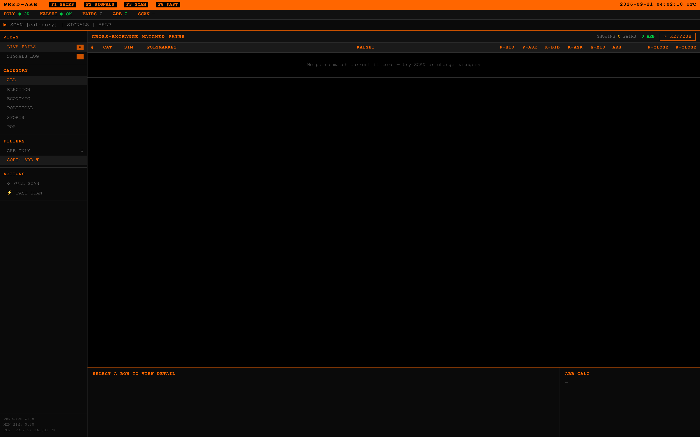
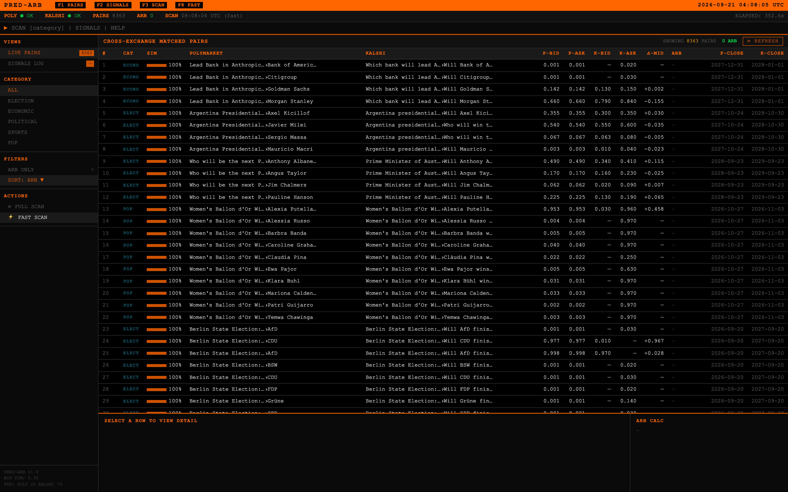
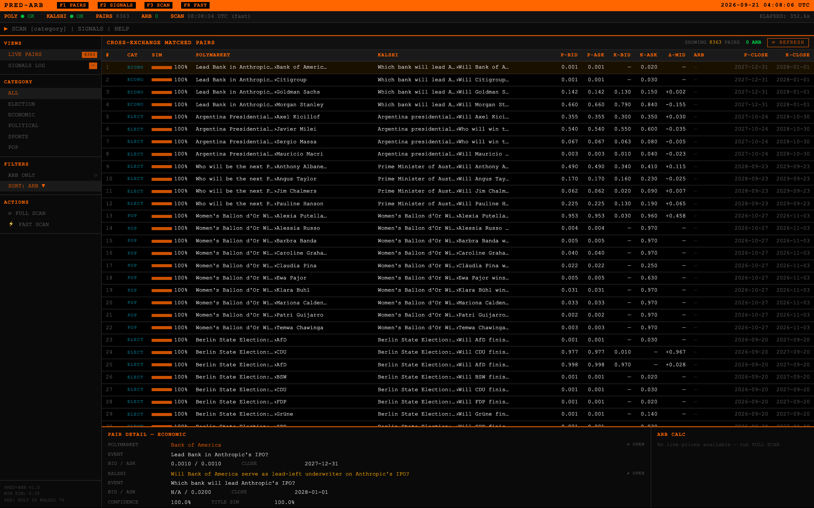

# Prediction Market Arbitrage Pipeline

A full-stack Python pipeline that ingests live order-book data from
[Polymarket](https://polymarket.com) and [Kalshi](https://kalshi.com),
matches equivalent markets across exchanges, detects two-leg arbitrage
opportunities, verifies them against live CLOBs, and optionally executes
orders — all with a single command.

> **Network note**: Polymarket's APIs block many residential IPs (incl. AU/US).
> The pipeline routes through **Cloudflare WARP by default** — WARP's Cloudflare
> egress (AS13335) reaches `gamma-api.polymarket.com` where a direct connection
> times out. One-time setup (Windows):
>
> ```powershell
> winget install --id Cloudflare.Warp --accept-package-agreements --accept-source-agreements
> & "C:\Program Files\Cloudflare\Cloudflare WARP\warp-cli.exe" registration new
> & "C:\Program Files\Cloudflare\Cloudflare WARP\warp-cli.exe" connect
> ```
>
> WARP is **Always-On** and its service starts automatically, so it reconnects on
> boot and every process (this pipeline included) uses it without further action.
> Verify with `warp-cli status` (→ `Connected`) and the dashboard's `/api/status`
> (→ `polymarket: ok`).

---

## What it does today (live, 2026-09-21)

| Capability | Status |
|---|---|
| Ingest the **entire** open catalog of both venues | Kalshi 13,278 events / 118,405 markets (14 s); Polymarket 18,916 events / 174,625 markets (12 s) |
| Match everything against everything | full cross-product, no event cap; ~2.5 min of matching |
| Pair sports games whose titles share no words ("Denver wins" ↔ "Broncos vs. Chiefs") | structured join on teams + start time, **97% of the Kalshi games that have a Polymarket counterpart**; cross-venue price gap median 1c |
| Reconcile the two venues' **team naming** ("Los Angeles R" ↔ "Rams", code `lar` ↔ `la`) | letter-shorthand + code-prefix bridge, strict token match first so it can't steal a real one; **+23 contract pairs, 0 lost** on a frozen catalog |
| Pair **spreads, totals, team totals, half lines and MLB player props** on those games ("wins by more than 2.5 goals" ↔ "Spread -2.5"; "1+ hits+runs+RBIs" ↔ "O/U 0.5") | 12 contract classes on the verified game key; equal-line join; football half *winners* refused (tie-leg mismatch) |
| Pair text-alike markets (elections, awards, economics, culture…) | ~7,500 text pairs, **92.6% of an independent oracle's pairs matched — and 92.6% endorsed too** (the referee no longer rejects what the matcher finds); House races 96% |
| Flag pairs whose wording matches but settlement may not (weather stations, one-sided deadlines) | kept visible, excluded from alerts (~460 pairs) |
| Reject look-alike contracts from event context | 26 rules (single game vs season, "run for" vs nominee, county vs state, CA-04 vs MO-04, division vs conference, reach vs win, top-5 vs winner, playoff seed, vote share vs winning, week vs season, "$1t+ IPO" vs plain, stat-line values, bps range, …) with a regression test each |
| Reach **multi-leg** relationships a 1-to-1 matcher structurally cannot (Kalshi `Kotek, 8+ pts` ↔ the **sum** of Polymarket's `9-12%`, `12-15%`, `15-18%`, `18%+`) | `ladder_match.py` + `python -m tools.ladder_report`; 235 rungs across 25 midterm margin-of-victory races, 28 settlement-safe edges. **Review only** — no N-leg executor, no depth data |
| Measure coverage live | `python -m tools.coverage_report [--text]` — ingestion counts, sports recall vs an independent oracle, price agreement. A funnel audit (pass 14) pins what is ingested vs held out of matching and why |
| Price every endorsed pair from live order books, compute net-of-fee edge both directions | ~485 positive-net candidates per full scan, 51 above the alerter's 3c threshold; the top of the list AND the 3–5c band are hand-audited (16 mismatch classes removed in passes 12–13) |
| Email / dashboard / dry-run execution | `alerter.py`, `server.py`, `executor.py` |

Honest caveat on the ladder work: a threshold that falls *inside* a bucket
still trades, because the right basket per direction is an exact settlement
dominance (buy the rung / sell the buckets entirely above it; or sell the rung /
buy those plus the straddling one). But the first live run reported 76 positive
edges and was wrong — it priced off `outcomePrices`, a single Polymarket *mid*
written to both sides of the snapshot book, instead of the real
`catalog_bid`/`catalog_ask`. Correcting that, and charging asks to buy and bids
to sell, cut it to 28. Assume any ladder number quoted without real books is
inflated ~3×.

Honest caveat, measured rather than assumed: **sports pairs yield almost no
arbitrage** (5 positive edges out of 1,127 priced pairs, best +2.5c, all on
illiquid books) — cross-venue sports pricing is efficient, so that work bought
coverage, not opportunities. **Every edge above 3c comes from text-matched
pairs**, which is why the largest edges are hand-audited each pass: 13 of the
top 16 were mismatches before pass 12, roughly 2 of the top 10 after. Treat every
alert as a candidate until the settlement check passes. Coverage, gaps and the
fix log live in
[docs/EXPANSION_PROPOSAL.md](docs/EXPANSION_PROPOSAL.md#progress-log).

### Demo — run it yourself, step by step

Every number and screenshot below came from a real run on 2026-09-21 against
both live APIs. Nothing here is mocked; re-running the same commands reproduces
them (with today's prices).

**0. Install** — Python 3.11+, no credentials needed for any read-only step.

```bash
git clone https://github.com/nl2992/prediction-pipeline && cd prediction-pipeline
python3 -m venv .venv && .venv/bin/pip install -r requirements.txt -r requirements-dev.txt
```

**1. Check both venues answer.**

```bash
.venv/bin/python -m tools.smoke_test
```

**2. Ingest both catalogs and match everything.** This is the production path —
it walks the *entire* open catalog of both venues, with no event cap.

```bash
.venv/bin/python alerter.py --once --dry-run
```

```
[1/4] Ingesting Kalshi open-market catalog…
      [coverage] Kalshi: 103,451/103,451 open markets ingested (100.0%, incl. 18 orphans)
[2/4] Ingesting Polymarket open-market catalog (full event catalog scan)…
      [coverage] Polymarket: 148,215/148,215 open markets ingested (100.0%, incl. 494 orphans)
[3/4] Running two-level group matcher (min_sim=0.3)…
      8350 pairs found (1168 sports-key, 7182 text)
[alerter] scan done in 619s — cap=None, 8350 pairs, 599 survivable arb(s) (>= 0.01c net)
[alerter] DRY RUN — would email: [Pred-Arb] 50 arbs >3% net — best 423% annualised
```

**Ingestion is 100% of both open catalogs.** Matching is not 100%, and cannot
be — see [What "100%" means](#what-100-means-two-different-questions) below.

> Note: `discover.py --days 730` applies a **horizon filter** and ingests 96.8%
> of Kalshi (3,342 markets close beyond the window). Omit `--days` for the full
> catalog. The alerter never applies one.

**3. Look at the matched pairs.**

```bash
.venv/bin/python discover.py --show-prices --output pairs.json
```

```
  #1  [elec]  sim=0.95
      Poly:   Zohran Mamdani
      Kalshi: Who will win the NYC mayoral election? Zohran Mamdani
      Prices: Poly [bid=0.835 ask=0.840]   Kalshi [bid=0.830 ask=0.850]
```

**4. Measure coverage and recall against independent oracles.**

```bash
.venv/bin/python -m tools.coverage_report --text   # recall vs an oracle
.venv/bin/python -m tools.coverage_ledger          # what happens to EVERY market
```

**5. Multi-leg ladder candidates** — Kalshi cumulative rungs vs sums of
Polymarket buckets, which a 1-to-1 matcher structurally cannot reach.

```bash
.venv/bin/python -m tools.ladder_report --min-edge 0.05
```

```
  235 Kalshi rungs synthesised across 25 races (63 land on a bucket edge)
  +0.163  oregon governor - kotek 8+ pts (straddled)
          Kalshi KXMIDTERMMOV-ORGOVD-P8  bid 0.36 / ask 0.41
          buy rung on Kalshi + sell above-only basket on PM  (4 PM legs)
```

**6. The dashboard.**

```bash
.venv/bin/pip install uvicorn
.venv/bin/python -m uvicorn server:app --port 8000   # http://127.0.0.1:8000
```

A terminal-style monitor over the same engine. It opens idle, with a live
health check on both venues:



`FAST SCAN` then walks both full catalogs and fills the table — **8,363 pairs
in 353s** on this run, sortable and filterable by category:



Note `ARB 0` in the status bar: **`FAST SCAN` uses catalog mid-prices only and
does not price arbitrage.** Use `FULL SCAN` (or the alerter) for live order
books — the arb calculator says so explicitly rather than showing a zero.

Selecting a row opens the pair detail, which is how you sanity-check a match
before trusting it — here Polymarket's `Bank of America` against Kalshi's
"Will Bank of America serve as lead-left underwriter on Anthropic's IPO?":



The screenshots are generated, not hand-taken, so they can be refreshed after a
UI change and always show a real scan:

```bash
.venv/bin/pip install playwright && .venv/bin/playwright install chromium
.venv/bin/python -m tools.capture_dashboard
```

### Are there arbitrage opportunities right now?

From the 2026-09-21 run: **599 candidates survive the net-of-fee filter, and the
top 50 by edge would be emailed** (median 6.3c, best 14.2c net).

That is the honest raw number, and it is **not** a claim that 599 trades exist.
Hand-checking the 50 that would have been emailed, several are known
false-positive classes the matcher still passes. Two verified end-to-end from
this run's `pairs.json`:

```
K: Will there be a recession in 2027? Yes
P: US recession by end of 2027?          <- "by end of" vs "during", a documented class

K: Steel Bridge National Championship Winner: Iowa State
P: Iowa State  [event: 2027 Men's College Basketball National Champion]
                                          <- an ASCE student engineering contest
                                             matched to a basketball title
```

The AI settlement check that would catch these is **shadow-mode and was SKIPPED
on this run — no API key present**.

Two further caveats, both measured rather than assumed:

* **The two entry points disagree, and the reason matters.** On the same
  catalog, `discover.py --days 730 --show-prices` computed a net edge for only
  **1 of 7,903** pairs — `--enrich-margin` fetches live books for a subset by
  default, and a pair with no live book gets no net number at all. 843 pairs
  showed a positive *catalog* gross edge, but catalog quotes are systematically
  optimistic: the ladder work measured them inflating opportunity roughly
  **3x** (76 apparent edges → 28 against real books). Trust the alerter's
  figure, not the catalog one.
* **Sports pairs yield almost no arbitrage.** Measured on the pass-12 run:
  5 positive edges out of 1,127 priced pairs, best +2.5c, all on illiquid
  books. Cross-venue sports pricing is efficient, so that work bought coverage,
  not opportunities — the +23 pairs from the pass-17 naming bridge are expected
  to behave the same way.

Treat every signal as a candidate until settlement is verified.

### What "100%" means — two different questions

The recurring goal is "pull all events, and match all". Those are two different
targets, and only one of them can reach 100%:

| Question | Status | Evidence |
|---|---|---|
| **Ingestion** — do we pull every open market on both venues? | **Yes, 100%** | `Kalshi 103,451/103,451 · Polymarket 147,491/147,491` on every production scan; `tools.validate_coverage` exits non-zero if a gap appears |
| **Matching** — is every ingested market paired with one on the other venue? | **No, and it never can be** | `tools.coverage_ledger` |

The second is not a bug to be fixed. **76% of Kalshi markets and 51% of
Polymarket markets sit in classes the other venue does not list at all.**
Polymarket has 10,316 `soccer_exact_score` and 7,602 `total_corners` markets;
Kalshi lists no corner or exact-score market whatsoever. Kalshi has vote-percent
ladders and hourly index ranges with no Polymarket equivalent. A market with no
counterpart cannot be matched, and pretending otherwise would mean inventing
pairs — which is precisely the failure mode the audits in
[docs/EXPANSION_PROPOSAL.md](docs/EXPANSION_PROPOSAL.md#progress-log) keep
removing.

So the meaningful target is **recall against the pairs that genuinely exist**:

* **Text pairs: 92.6%** of an independent oracle's pairs, and a hand-labelled
  sample of 60 misses was 63% real / 37% oracle error — so ~91% of the oracle is
  the realistic ceiling and adjusted true recall is **≈95%**.
* **Sports: 97%** of Kalshi games that have a Polymarket counterpart.
* **Ladders:** Kalshi's 4,552 midterm margin-of-victory markets are reachable
  only as multi-leg sums, now handled review-only by `tools.ladder_report`.

---

## Repository structure

```
prediction-pipeline/
├── pipeline.py          # Data ingest: fetch + normalise both exchanges
├── discover.py          # Organic cross-exchange discovery (production scan path)
├── sports_match.py      # Structured sports join: moneylines, spreads, totals
├── matcher.py           # v1 matcher: Jaccard + close-time + deterministic vetoes
├── contract_spec.py     # v2 structured matcher (shadow referee on every v1 pair)
├── ladder_match.py      # Multi-leg synthesis: Kalshi cumulative rungs ↔ sums of PM buckets
├── arb.py / book_arb.py # Two-leg arb detection; depth / VWAP / profit-by-stake
├── executor.py          # Order execution engine (dry-run by default)
├── monitor.py           # Continuous polling loop → signals.jsonl
├── alerter.py           # Scheduled scan → email alerts (see docs/OPERATIONS.md)
├── ai_verify.py         # Optional LLM settlement-equivalence check
├── server.py + static/  # FastAPI dashboard
├── fed_rate_spread.py   # Fed rate spread analysis across both exchanges
├── health.py, ops.py, signal_report.py, ai_verify_report.py   # operator tools
├── kalshi/client.py     # Kalshi Trade API v2 client (public + auth)
├── polymarket/client.py # Polymarket CLOB + Gamma API client (public + auth)
├── tools/               # Live probes: smoke_test, coverage_report, coverage_ledger,
│                     #   ladder_report, capture_dashboard, validate_{live,recall,ingestion,matcher}
├── tests/               # Hermetic pytest suite (CI) + fixtures
└── docs/                # Guides, OPERATIONS.md; docs/history/ holds validation logs
```

Run the live probes from the repo root as modules, e.g. `python -m tools.smoke_test`.

---

## Quick start

```bash
pip install -r requirements.txt                          # runtime: only `requests` is required
pip install -r requirements.txt -r requirements-dev.txt  # + pytest, ruff, fastapi, … (what CI installs)

python -m tools.smoke_test          # 1. verify connectivity to both exchanges
python discover.py --show-prices    # 2. full cross-exchange scan, matched pairs + live prices
python alerter.py --once --dry-run  # 3. one production cycle, email printed instead of sent
```

All commands run from the repo root. Every script is public-data only unless a
flag says otherwise; nothing places an order without `--execute --no-dry-run`.

---

## Terminal commands

### At a glance

| Command | What it does | Network | Writes |
|---|---|---|---|
| `python discover.py` | Organic scan of **both full catalogs** → matched pairs | yes | `--output` JSON |
| `python monitor.py` | Poll → match → arb → CLOB-verify, optionally execute | yes | `signals.jsonl`, `monitor.log` |
| `python alerter.py` | Production loop: full scan → email executable arbs | yes | `alert_*.json[l]`, `ai_verify.jsonl` |
| `python pipeline.py` | Raw ingest of both exchanges (+ optional arb pass) | yes | `./output/*.json` |
| `python fed_rate_spread.py` | Fed-rate ladder spread + monotonicity arb check | yes | — |
| `python server.py` | FastAPI dashboard on `http://localhost:8000` | yes | — |
| `python ops.py` | Health + opportunities + matcher QA in one view | no | — |
| `python health.py [LOG]` | Alerter status; exit 0 = OK, 1 = DEGRADED | no | — |
| `python signal_report.py [FILE]` | Digest of emailed arbs (`alert_signals.jsonl`) | no | — |
| `python ai_verify_report.py [FILE]` | Digest of AI verdicts (`ai_verify.jsonl`) | no | — |
| `python ai_verify.py "A" "B"` | One-off LLM settlement-equivalence check | DeepSeek | `ai_verify.jsonl` |
| `python -m tools.<probe>` | Live validation probes (see below) | yes | — |
| `python -m pytest -q` | Hermetic test suite (no network, no secrets) | no | — |

### `discover.py` — full-catalog cross-exchange discovery

The production scan path (the alerter and `monitor.py --discover` call it).
Ingests **100% of both open catalogs**: Kalshi `/events?with_nested_markets=true`
plus a `/markets` orphan sweep, and Polymarket `/events/keyset` plus a
`/markets/keyset` orphan sweep. It prints a `[coverage]` line per venue, then
matches them. See [docs/COVERAGE.md](docs/COVERAGE.md).

```bash
python discover.py                                   # everything, no limits (~5-6 min, sweep-bound)
python discover.py --no-market-sweep                 # skip orphan sweeps (~2 min, >99.7% coverage)
python discover.py --category sports --days 7        # sports closing within a week
python discover.py --show-prices --output pairs.json # fetch live books, save pairs
python discover.py --coverage-json cov.json          # write the per-venue coverage accounting
python discover.py --max-events 500 --poly-scan 5000 # bounded (faster) scan
```

| Flag | Default | Meaning |
|---|---|---|
| `--category {all,election,sports,economic,political,pop}` | `all` | Event category filter |
| `--days N` | none | Only events closing within N days |
| `--min-sim F` | `0.30` | Minimum Jaccard title similarity for a pair |
| `--show-prices` | off | Fetch live order books for matched pairs |
| `--max-events N` | none | Cap on Kalshi events scanned |
| `--poly-scan N` | none | Cap on Polymarket events scanned |
| `--kalshi-workers N` | `6` | Threads for the (rare) per-event Kalshi fallback fetch |
| `--no-market-sweep` | sweeps on | Skip both orphan sweeps (faster; misses markets whose parent event isn't listed) |
| `--coverage-json PATH` | none | Write ingested / excluded-by-reason counts per venue |
| `--enrich-margin F` | off | With `--show-prices`: fetch live books only for endorsed pairs whose catalog edge is ≥ −F. Rarely useful: batched Kalshi books make enriching every pair take ~4 s |
| `--no-enrich-margin` | default | Fetch live books for every v2-endorsed pair |
| `--output PATH` | none | Write matched pairs as JSON |

### `monitor.py` — continuous arb monitor

```bash
# One-off scan — Fed rate markets, compare across both exchanges
python monitor.py --once \
  --kalshi-series KXFED \
  --poly-keywords "federal funds" "fed rate" "upper bound" "lower bound" \
  --max-close-delta-hours 9999 \
  --min-profit-pct 0 --no-verify --show-unverified

# Continuous monitor over the full organic catalog, every 5 minutes
python monitor.py --discover --interval 300

# A single Polymarket event vs a single Kalshi event
python monitor.py --once --poly-event-slug ky-04-republican-primary-winner --kalshi-event <TICKER>
```

```
Scan control:
  --once                      Single scan then exit (exit 1 on a scan error)
  --interval INT              Seconds between scans (default: 300)

Market selection (fixed-series mode):
  --poly-limit INT            Polymarket markets per scan (default: 50)
  --kalshi-limit INT          Kalshi markets per scan (default: 50)
  --kalshi-series STR         Kalshi series ticker, e.g. KXFED
  --kalshi-event STR          Kalshi event ticker
  --poly-event-slug STR       All markets of one Polymarket event (beats --poly-keywords)
  --poly-keywords KW ...      Substring keywords to search the Polymarket catalog

Market selection (organic mode — uses discover.py):
  --discover                  Scan both full catalogs instead of fixed series
  --discover-category STR     all | election | sports | economic | political | pop
  --discover-days INT         Horizon in days (default: no limit)
  --discover-max-events INT   Max Kalshi events per cycle (default: no limit)
  --discover-market-sweep     Include the orphan sweeps (off by default: ~290 s)

Matching:
  --min-match-sim FLOAT       Minimum Jaccard similarity (default: 0.30)
  --max-close-delta-hours F   Close-time proximity window (default: 72). A scoring
                              bonus, never a hard exclusion (Kalshi sports markets
                              carry far-out contractual expiry dates).

Arb thresholds:
  --min-profit-pct FLOAT      Minimum net profit % (default: 0.5)
  --fee-poly FLOAT            Polymarket fee (default: 0.02)
  --fee-kalshi FLOAT          Kalshi fee (default: 0.07)

CLOB verification:
  --no-verify                 Skip the live CLOB recheck (not recommended)

Execution:
  --execute                   Auto-execute verified signals
  --dry-run                   Log orders only, no real placement (default)
  --no-dry-run                Live placement (requires credentials in env)
  --max-position FLOAT        Max USD per two-leg trade (default: 100)
  --size-contracts FLOAT      Contracts per leg (default: 10)

Output:
  --signals-file PATH         JSONL signal file (default: signals.jsonl)
  --log-file PATH             Log file, appended (default: monitor.log)
  --log-level STR             DEBUG | INFO | WARNING | ERROR (default: INFO)
  --show-unverified           Print CLOB-failed signals too
```

### `alerter.py` — production email alerter

Runs the full `discover` scan, prices both fee models, and emails pairs whose net
edge clears the threshold. Details, config keys and failure handling are in
[docs/OPERATIONS.md](docs/OPERATIONS.md).

```bash
python alerter.py --once --dry-run   # one cycle, print the email instead of sending
python alerter.py --once             # one cycle, send; exit 1 on a cycle error
python alerter.py --interval 900     # loop forever, one cycle every 15 min
```

| Flag | Default | Meaning |
|---|---|---|
| `--interval SEC` | `300` | Seconds between cycles |
| `--min-edge F` | `0.0001` | Min net edge ($ per $1 payout, accurate Kalshi fee) |
| `--realert-hours H` | `6` | Re-email an unchanged signal after H hours |
| `--min-size N` | `20` | Min best-level depth on both legs (`0` = off) |
| `--once` | off | Run one cycle and exit |
| `--dry-run` | off | Never send email; print instead |

Email settings come from `alert_config.json` (gitignored) or env vars
`ALERT_SMTP_HOST`, `ALERT_SMTP_PORT`, `ALERT_SMTP_USER`, `ALERT_SMTP_PASS`,
`ALERT_FROM`, `ALERT_RECIPIENTS` (comma-separated; env wins). Without credentials
the alerter still runs and just prints signals. The AI gate reads `DEEPSEEK_API_KEY`.

### `pipeline.py` — raw ingest

```bash
python pipeline.py --kalshi-series KXFED --poly-limit 50 --arb
python pipeline.py --kalshi-event <TICKER> --no-poly-books --output-dir ./output
```

Flags: `--poly-limit` / `--kalshi-limit` (default 20), `--no-poly-books`,
`--no-kalshi-books` (top-of-book only), `--kalshi-series`, `--kalshi-event`,
`--output-dir` (default `./output`), `--arb`, `--fee-poly`, `--fee-kalshi`,
`--min-profit-pct` (default 0.0), `--log-level`.

### `fed_rate_spread.py` — Fed-rate ladder analysis

```bash
python fed_rate_spread.py                        # auto-detects next FOMC meeting
python fed_rate_spread.py --event KXFED-26JUN    # a specific meeting
python fed_rate_spread.py --lower-bound 3.50 --upper-bound 3.75 --fee 0.02
```

Also `--poly-timeout` (default 15 s) and `--kalshi-timeout` (default 20 s).

### Dashboard

```bash
pip install fastapi uvicorn
python server.py          # http://localhost:8000 — /api/status checks both venues
```

### Operator tools (read local logs only — no network)

```bash
python ops.py                        # everything below in one view; exit 0 healthy / 1 degraded
python health.py                     # STATUS: OK | DEGRADED (reads alerter_cron.log)
python health.py path/to/alerter_cron.log
python signal_report.py              # recurring / richest / best-annualised arbs
python ai_verify_report.py           # AI verdict digest: matcher false-positives vs settlement drops
python ai_verify.py "Poly market text" "Kalshi market text"   # needs DEEPSEEK_API_KEY
```

`python ops.py || <notify>` works as a watchdog.

### Live probes (`tools/`)

Excluded from the hermetic suite; they hit both live APIs.

```bash
python -m tools.smoke_test                                   # connectivity + response shapes
python -m tools.validate_coverage [--json] [--no-sweep]      # ingestion vs ground truth; exit 0 iff no gaps
python -m tools.validate_live --min-pairs 20 --max-events 200 [--json]
python -m tools.validate_recall --production 0.30 --relaxed 0.20 --max-events 200 [--json]
python -m tools.validate_ingestion --prod-cap 200 --wide-cap 500 [--json]
python -m tools.validate_matcher --n 20 --offset 0 --min-sim 0.30 [--json]
python -m tools.ladder_report --min-edge 0.05 [--json]       # multi-leg ladder candidates (review only)
```

| Probe | Question it answers |
|---|---|
| `smoke_test` | Can we reach both venues and parse their books? |
| `validate_coverage` | Does ingestion cover 100% of both venues' open markets? (misses split into drift vs real gaps) |
| `validate_live` | Do live `discover` pairs survive the v2 referee? |
| `validate_recall` | How many more pairs would a lower similarity threshold find? |
| `validate_ingestion` | How many more pairs would a wider event cap find? |
| `validate_matcher` | Does the matcher still pair the curated fixture set? |
| `ladder_report` | Where does a Kalshi cumulative rung disagree with the sum of Polymarket's buckets? |
| `capture_dashboard` | Regenerates the README's dashboard screenshots from a real scan (needs Playwright) |

### Tests and lint (what CI runs)

```bash
python -m ruff check --select F,E9,B .   # real-bug lint categories only
python -m pytest -q                      # hermetic: no network, no secrets
python -m pytest tests/test_discover.py -q -k Nested   # a subset
```

---

## How it works

### 1. Data ingest (`pipeline.py`)

**Polymarket** — two public APIs:
- **Gamma API** (`gamma-api.polymarket.com`): market discovery.  
  Full-catalog scans walk `/events/keyset` by cursor — offset pagination on
  `/events` is rejected with HTTP 422 past offset ~2100. `tag_slug` and `_q`
  are broken on Gamma, so titles are filtered client-side.
- **CLOB API** (`clob.polymarket.com`): live order books via `POST /books`  
  (batch token lookup — one request for all markets in a scan).

**Kalshi** — one public API:
- `api.elections.kalshi.com/trade-api/v2`  
  `/events?with_nested_markets=true` for full-catalog discovery (every open
  event with its markets embedded, ~60 pages), `/markets` for series/event
  lookups, `/markets/{ticker}/orderbook` for full depth (public, no auth).

All data is normalised into `MarketSnapshot` / `OrderBook` objects:

```python
from pipeline import run_pipeline

result = run_pipeline(
    polymarket_limit=50,
    kalshi_limit=50,
    kalshi_series_ticker="KXFED",
    poly_keywords=["federal funds", "upper bound"],
    run_arb=True,
)
for opp in result["arb"]:
    if opp.is_profitable:
        print(opp)
```

### 2. Order-book conventions

**Polymarket** — standard CLOB: `bids` sorted price descending, `asks` ascending.  
YES token is resolved by matching the `outcomes` label; index 0 is the safe default for binary markets.

**Kalshi** — bids-only format:
- `yes_dollars`: list of `[price, size]` YES bid levels (ascending price).
- `no_dollars`: list of `[price, size]` NO bid levels (ascending price).
- YES asks are **derived** from NO bids: `yes_ask_price = 1.0 − no_bid_price`.
- Prices are in dollars (0.59 = 59 cents = 59% implied probability).

### 3. Market matching (`matcher.py`)

Greedy 1-to-1 pairing by combined score:

```
confidence = 0.70 × Jaccard(title_tokens_A, title_tokens_B)
           + 0.30 × max(0, 1 − Δhours / max_close_delta_hours)
```

Stopwords are stripped; punctuation removed.  
Manual overrides bypass heuristics entirely.

### 4. Arbitrage detection (`arb.py`)

For each matched pair, two directions are checked:

| Direction | Leg A | Leg B | Gross cost |
|---|---|---|---|
| `poly_yes__kalshi_no` | Buy YES on Poly at `poly_yes_ask` | Buy NO on Kalshi at `1 − kalshi_yes_bid` | `poly_yes_ask + (1 − kalshi_yes_bid)` |
| `kalshi_yes__poly_no` | Buy YES on Kalshi at `kalshi_yes_ask` | Buy NO on Poly at `1 − poly_yes_bid` | `kalshi_yes_ask + (1 − poly_yes_bid)` |

`net_profit = 1.0 − gross_cost − max(fee_poly, fee_kalshi)`

Defaults: `fee_poly=0.02`, `fee_kalshi=0.07`.

### 5. Live CLOB verification (`monitor.py`)

Before flagging a signal, the monitor re-fetches both legs from the live CLOB and rejects if:
- No live bid/ask exists.
- Price has drifted >3 cents from the detected price.
- Polymarket CLOB depth <$10 at best level.

Verified signals are written as JSON Lines to `signals.jsonl`.

### 6. Execution (`executor.py`)

Dry-run by default — logs intended orders without placing them.

```
Kalshi side convention (v2 API):
  side="bid"  → buy YES contracts
  side="ask"  → sell YES (creates NO exposure)
```

Leg A is placed first. If leg A succeeds but leg B fails, leg A is cancelled automatically.

---

## Fed rate spread analysis

`fed_rate_spread.py` provides a more nuanced view of Fed rate markets:

- Fetches the full **KXFED threshold ladder** from Kalshi and derives an implied  
  probability distribution: `P(rate = X%) = P(above X_prev) − P(above X)`.
- Fetches all Polymarket Fed markets (count cuts / upper/lower bound reach).
- Detects **monotonicity violations** within either ladder  
  (e.g. `P(rate reaches 4.75%) > P(rate reaches 4.50%)` — structurally impossible).
- Verifies violations against live CLOBs before flagging (avoids ghost markets).
- Derives cross-horizon implied probabilities:  
  `P(cut H2 | hold June) = (P_year(at least 1 cut) − P(hold June)) / P(hold June)`

```bash
python fed_rate_spread.py                        # auto-detects next FOMC meeting
python fed_rate_spread.py --event KXFED-26JUN    # target specific meeting
```

> **Horizon note**: Kalshi KXFED markets resolve on the FOMC meeting date;  
> Polymarket "reach X% before 2027" markets resolve end-of-year.  
> These are **not directly arbitrageable** but are comparable for spread analysis.  
> Use `--max-close-delta-hours 9999` in `monitor.py` to surface them anyway.

---

## Credentials (optional — for order placement only)

All market-data endpoints are public. Credentials are only needed for `--execute --no-dry-run`.

```bash
# Kalshi
export KALSHI_API_KEY="your-key-id"
export KALSHI_PRIVATE_KEY_PATH="/path/to/kalshi_private.pem"

# Polymarket
export POLY_API_KEY="your-api-key-uuid"
export POLY_API_SECRET="your-url-safe-base64-secret"
export POLY_API_PASSPHRASE="your-passphrase"
export POLY_PRIVATE_KEY="0x..."   # hex Ethereum/Polygon private key
```

---

## API references

- Polymarket CLOB: [docs.polymarket.com](https://docs.polymarket.com/)
- Kalshi Trade API v2: [docs.kalshi.com](https://docs.kalshi.com/)
- Cloudflare WARP: [one.one.one.one](https://one.one.one.one/)
